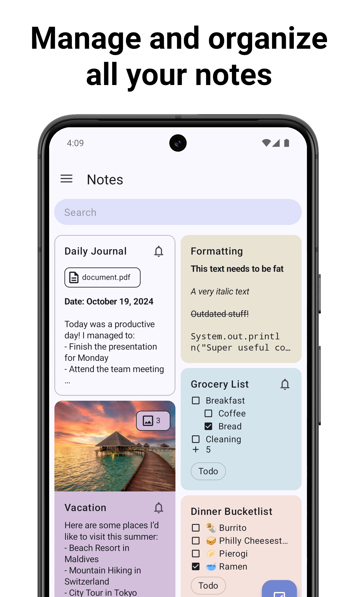
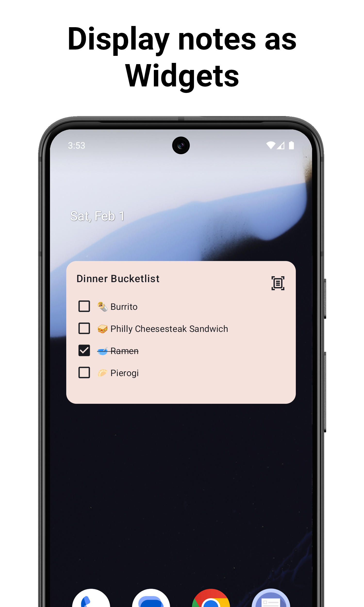

<h2 align="center">
    
     
    <b><a href="https://crustack.github.io/NotallyX/">ScribbleX | Minimalistic note taking app</a></b>
    

        

            Maintainer: Alzimer Ahmed (<a href="mailto:alzimerahmed84@gmail.com">alzimerahmed84@gmail.com</a>)
        

    

    

    <h1>Data-loss warning (inherited from upstream, see https://github.com/Crustack/NotallyX/issues/1066): if you use the app, ensure that you have setup auto-backup (e.g. daily) and ideally also backup on save!</h1>
    

    

        

            
            
            
        

    

</h2>

  
  
  

  
  
  

### Features
[Notally](https://github.com/OmGodse/Notally), but eXtended

<h4><a href="https://crustack.github.io/NotallyX/">See Documentation</a></h4>

* Create **rich text** notes with support for bold, italics, mono space and strike-through
* Create **task lists** and order them with subtasks (+ auto-sort checked items to the end)
* Set **reminders** with notifications for important notes
* Complement your notes with any type of file such as **pictures**, PDFs, etc.
* **Sort notes** by title, last modified date, creation date
* **Color, pin and label** your notes for quick organisation
* Add **clickable links** to notes with support for phone numbers, email addresses and web urls
* **Undo/Redo actions**
* Use **Home Screen Widget** to access important notes fast
* **Lock your notes via Biometric/PIN**
* Configurable **auto-backups**
* **Import from other apps** such as [Evernote](https://evernote.com/), [Google Keep](https://keep.google.com/), [Quillpad](https://quillpad.github.io/)
* Create quick audio notes
* Display the notes either in a **List or Grid**
* Quickly share notes by text
* Extensive preferences to adjust views to your liking
* Actions to quickly remove checked tasks
* Adaptive android app icon
* Support for Lollipop devices and up

---

### Bug Reports / Feature-Requests
If you find any bugs or want to propose a new Feature/Enhancement, feel free to [create a new Issue](https://github.com/Crustack/NotallyX/issues/new/choose)

When using the app and an unknown error occurs, causing the app to crash you will see a dialog (see showcase video in https://github.com/Crustack/NotallyX/pull/171) from which you can immediately create a bug report on Github with the crash details pre-filled.

#### Beta Releases

BETA versions are occasionally released during development to gather feedback before a public release.
These BETA releases have another `applicationId` as the release versions, thats why when you install a BETA version it will show up on your device as a separate app called `NotallyX BETA`.
BETA versions also have their own data, they do not use the data of your NotallyX app
You can download the most recent BETA release [here on Github](https://github.com/Crustack/NotallyX/releases/tag/beta)

#### APK Signing Certifcate Fingerprint

The upstream NotallyX signing certificate SHA256 fingerprint (for reference when verifying APK provenance):
`D2:14:B6:05:7B:79:F8:25:09:DD:CD:1E:35:19:65:B3:C6:EC:C4:B2:A3:89:6E:5C:DF:88:5A:70:A0:B6:1D:FD`

### Translations

All translations are crowd sourced.
For details on how to contribute translations and what languages are available, see [TRANSLATIONS](./TRANSLATIONS.md)

### Contributing

If you would like to contribute code yourself, just grab any open issue (that has no other developer assigned yet), leave a comment that you want to work on it and start developing by forking this repo.

The project is a default Android project written in Kotlin, I highly recommend using Android Studio for development. Also be sure to test your changes with an Android device/emulator that uses the same Android SDK Version as defined in the `build.gradle` `targetSdk`.

Before submitting your proposed changes as a Pull-Request, make sure all tests are still working (`./gradlew test`), and run `./gradlew ktfmtFormat` for common formatting (also executed automatically as pre-commit hook).

### Attribution
The original Notally project was developed by [OmGodse](https://github.com/OmGodse) under the [GPL 3.0 License](https://github.com/OmGodse/Notally/blob/master/LICENSE.md).

NotallyX was developed by [Philkes](https://github.com/Philkes) (maintained under the Crustack organization) under the [GPL 3.0 License](https://github.com/Crustack/NotallyX/blob/main/LICENSE.md).

ScribbleX is a fork of NotallyX. In accordance to GPL 3.0, this project remains licensed under the GPL 3.0 License. Maintainer: Alzimer Ahmed (alzimerahmed84@gmail.com).

